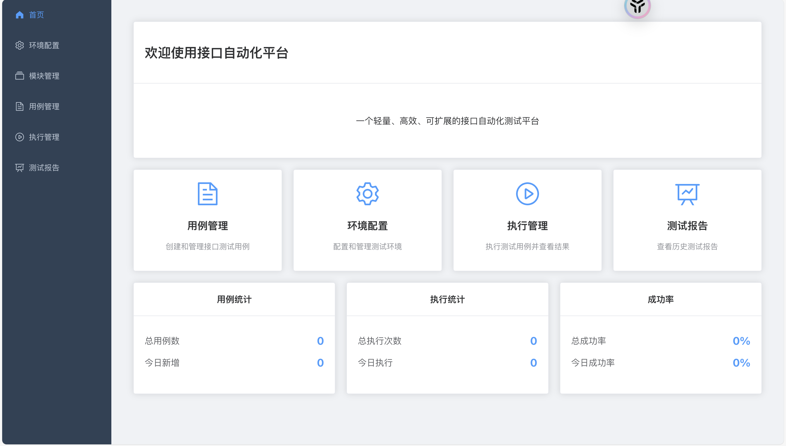
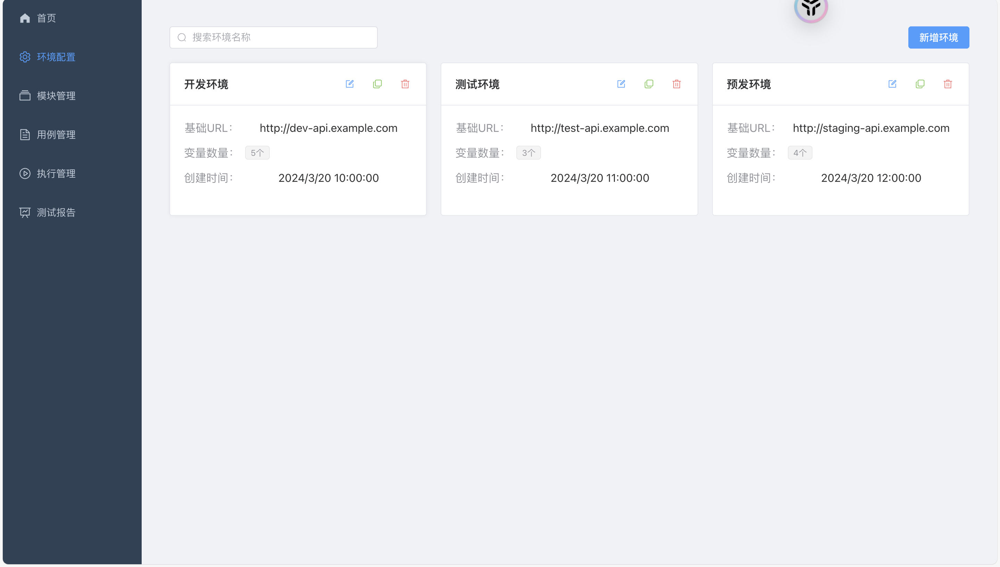
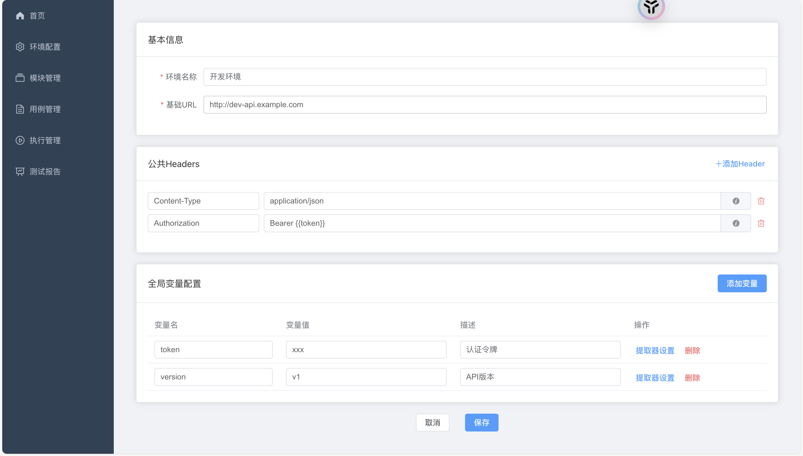
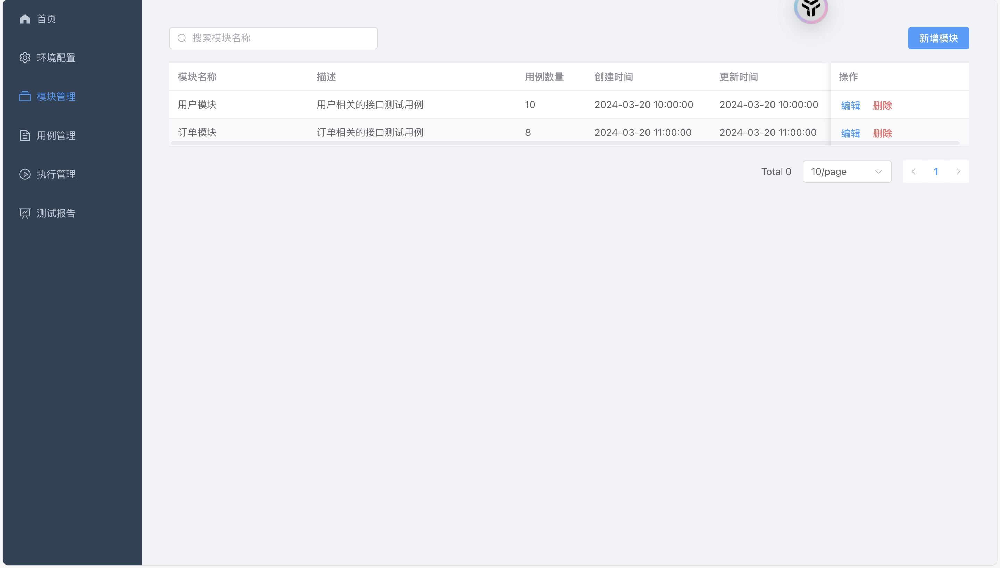
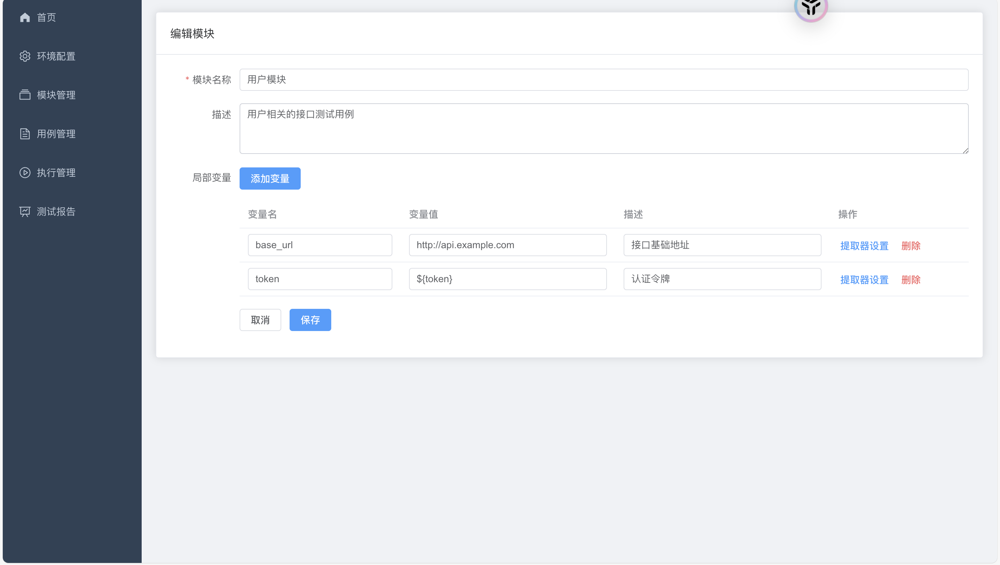
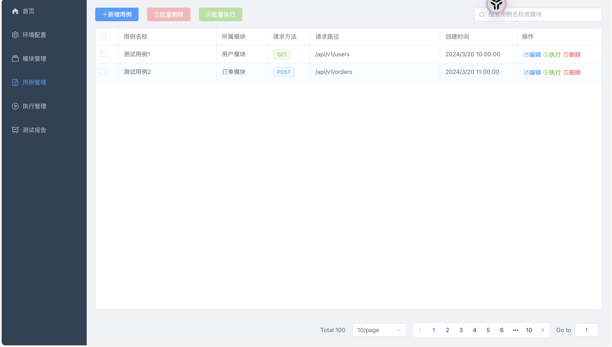
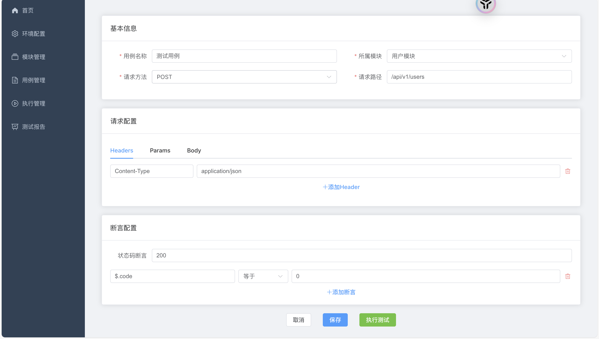
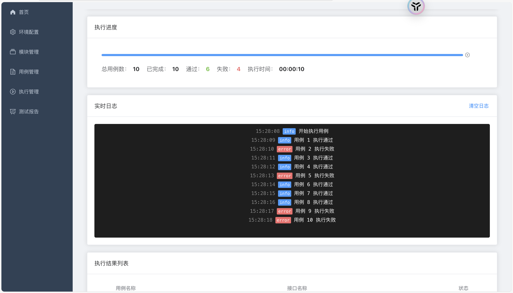
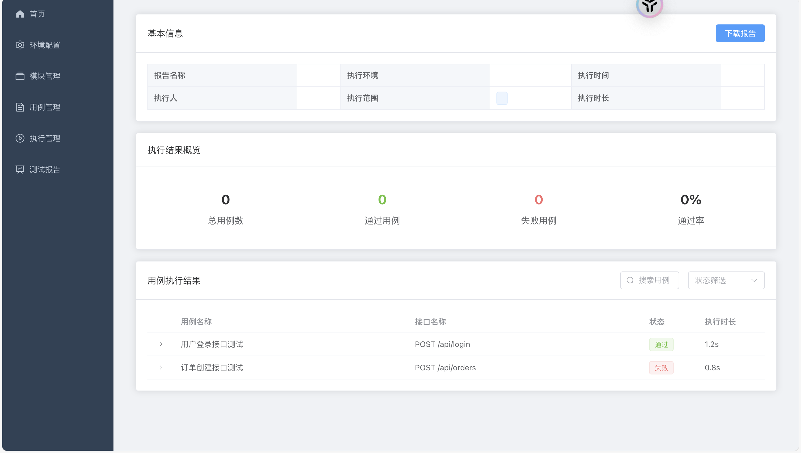

# API 自动化测试平台

一个基于 FastAPI 和 Vue3 的 API 自动化测试平台，支持环境管理、模块管理、测试用例管理、执行管理和报告管理等功能。

## 功能特点

### 环境管理
支持多环境配置和管理，可以轻松切换不同环境的配置。


### 模块管理
支持模块和模块变量的管理，方便组织和管理测试用例。


### 测试用例管理
支持测试用例的创建、编辑和执行，提供丰富的断言和参数化功能。


### 执行管理
支持测试用例的执行和结果查看，实时展示执行状态和结果。


### 报告管理
支持测试报告的生成和查看，提供详细的执行结果和统计信息。


### 仪表盘
支持测试数据的统计和可视化，直观展示测试执行情况。












## 技术栈

### 后端
- FastAPI：Web 框架
- SQLAlchemy：ORM 框架
- Pydantic：数据验证
- Alembic：数据库迁移
- Pytest：测试框架

### 前端
- Vue 3：前端框架
- Element Plus：UI 组件库
- Vue Router：路由管理
- Pinia：状态管理
- Axios：HTTP 客户端

## 项目结构

```
.
├── backend/                # 后端项目目录
│   ├── app/               # 应用代码
│   │   ├── api/          # API 路由
│   │   ├── core/         # 核心配置
│   │   ├── crud/         # 数据库操作
│   │   ├── models/       # 数据模型
│   │   ├── schemas/      # 数据验证
│   │   └── services/     # 业务逻辑
│   ├── tests/            # 测试代码
│   └── alembic/          # 数据库迁移
└── frontend/             # 前端项目目录
    ├── src/              # 源代码
    ├── public/           # 静态资源
    └── tests/            # 测试代码
```

## 安装步骤

1. 克隆项目
```bash
git clone https://github.com/yourusername/api-auto-test.git
cd api-auto-test
```

2. 安装后端依赖
```bash
cd backend
python -m venv venv
source venv/bin/activate  # Windows: venv\Scripts\activate
pip install -r requirements.txt
```

3. 配置数据库
```bash
# 创建 .env 文件
cp .env.example .env
# 编辑 .env 文件，配置数据库连接信息
```

4. 初始化数据库
```bash
alembic upgrade head
```

5. 安装前端依赖
```bash
cd frontend
npm install
```

## 运行项目

1. 启动后端服务
```bash
cd backend
uvicorn app.main:app --reload
```

2. 启动前端服务
```bash
cd frontend
npm run dev
```

3. 访问应用
- 后端 API 文档：http://localhost:8000/docs
- 前端应用：http://localhost:5173

## 开发指南

### 后端开发
1. 创建新的数据模型
```bash
# 在 app/models/ 目录下创建新的模型文件
```

2. 创建数据库迁移
```bash
alembic revision --autogenerate -m "description"
alembic upgrade head
```

3. 运行测试
```bash
pytest
```

### 前端开发
1. 创建新的组件
```bash
# 在 src/components/ 目录下创建新的组件文件
```

2. 运行测试
```bash
npm run test
```

